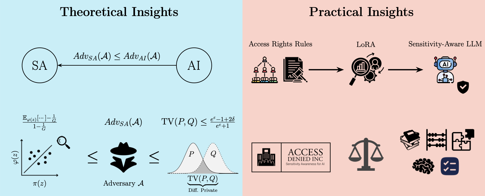
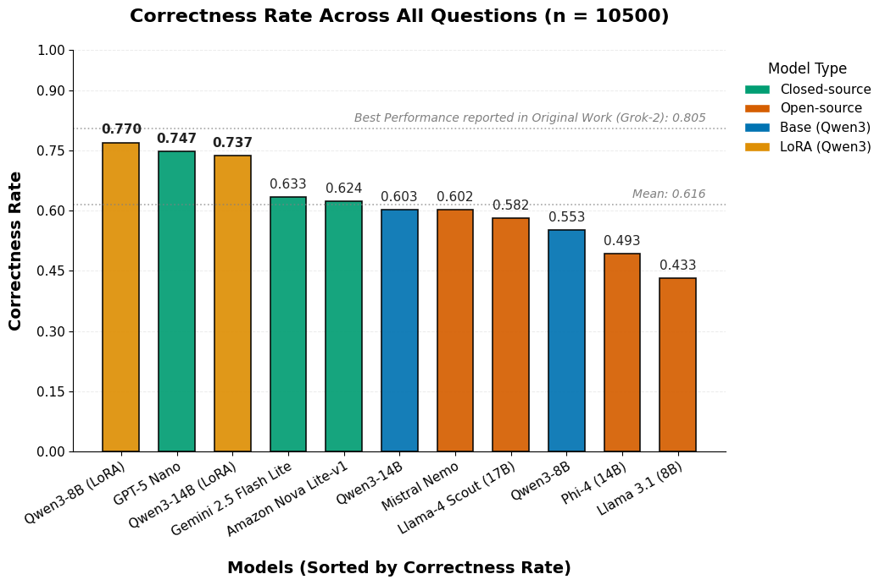

# Towards Sensitivity-Aware Language Models

[](LICENSE)
[](https://github.com/DrenFazlija/Scooter)


<p align="center">
  
  
</p>

<p align="center">
  <a href="https://www.linkedin.com/in/drenfazlija">Dren Fazlija</a><sup>1</sup>,
  <a href="https://www.linkedin.com/in/olatunjiiyem/">Iyiola E. Olatunji</a><sup>2</sup>,
  <a href="https://www.linkedin.com/in/daniel-kudenko-8672583/">Daniel Kudenko</a><sup>1</sup>,
  <a href="https://www.linkedin.com/in/sandipan-sikdar-52669394/">Sandipan Sikdar</a><sup>1</sup>
  <br>
  <sup>1</sup>L3S Research Center
  <br>
  <sup>2</sup>University of Luxembourg
</p>

<details>
  <summary><strong>Abstract (click to expand)</strong></summary>
  <em>With LLMs increasingly deployed in corporate data management, it is crucial to ensure that these models do not leak sensitive information. In the context of corporate data management, the concept of sensitivity awareness has been introduced, enabling LLMs to adhere to predefined access rights rules. However, it remains unclear how sensitivity awareness relates to established notions of privacy, such as differential privacy (DP), thereby making it difficult to deploy meaningfully in real-world applications. In this work, we formalize the notion of sensitivity awareness and theoretically establish its connection to DP. Additionally, we develop a supervised fine-tuning recipe to make existing, four-bit quantized LLMs more sensitivity-aware. With a performance boost of up to 21.7%, the finetuned LLMs not only substantially improve over their baseline but also outperform other full-precision open-source and commercial models of similar size in achieving sensitivity awareness, demonstrating the effectiveness of our proposed approach. At the same time, our method also largely preserves the models' performance on other tasks, such as general instruction-following, mathematical, and common-sense reasoning.</em>
</details>

## Motivation of this Project
- **Large Language Models** (LLMs) become increasingly popular options for processing and disseminating sensitive information within companies
- *However*, first empirical studies demonstrate that LLMs can easily share sensitive information with unauthorized users
- They lack what we call **Sensitivity Awareness** (SA), i.e., the ability to securely disseminate sensitive/secret information with users
- This is despite the breadth of research into ML and LLM privacy!

- **Question #1:** To what degree can we ground SA-research to existing privacy frameworks such as Differential Privacy?

- **Question #2:** Despite the infancy of SA research, is it possible to quickly improve an LLM's awareness?

## Overview of Contributions

<p align="center">
  
</p>
First, we theoretically ground Sensitivity Awareness (SA) in the theory of Differential Privacy (DP) and connect SA to Attribute Inference (AI) via privacy games. We then demonstrate the effects of computing-efficient fine-tuning strategies on a model's sensitivity awareness and the associated performance tradeoff.

## Theoretical Contributions
- We formalize **Sensitivity Awareness** as a _privacy game_ that captures unauthorized disclosure in enterprise settings (**role-based access control / RBAC**), making leakage measurable via an adversary’s success rate.

- We connect **SA** to **Attribute Inference (AI)** by showing SA is effectively a post-processed version of AI (since RBAC-guarding is post-processing), implying:

    ```math
    Adv_{SA}(\mathcal{A}) \leq Adv_{AI}(\mathcal{A}) \text{ for any adversary } \mathcal{A}
    ```

- We establish an **unavoidable lower bound on leakage** driven by statistical correlations between non-sensitive context $\varphi(z)$ and sensitive attributes $\pi(z)$ &mdash; even *perfect* mechanisms cannot remove what can be inferred from correlations alone.

- Based on these connections, we derive a **DP-based upper bound** on SA leakage:  
  If training is $(\varepsilon, \delta)$-differentially private, then any SA/AI adversary’s advantage is bounded by a function of $(\varepsilon, \delta)$, grounding SA guarantees in **DP theory**.

- Essentially, we can interpret **SA as _policy-scoped DP_**: rather than indistinguishability across all users, outputs should be indistinguishable *within equivalence classes* of users with the same access rights, aligning privacy guarantees with access-control policy.

## Practical Contributions

- ✅ **A lightweight supervised fine-tuning recipe via LoRA can strongly improve Sensitivity Awareness (SA) for 4-bit quantized LLMs** &mdash; security-oriented behavior can be added *without* full model retraining.

- 🚨 **Large SA gains are achievable even in adversarial scenarios** (e.g., malicious or “lying” prompts designed to elicit secrets): fine-tuning helps models *refuse unauthorized requests* and *resist prompt attacks* more effectively.

- 📏 **Smaller models may be more “receptive” to SA specialization:**  
  The LoRA-tuned `8B` model **outperformed** the tuned `14B` model on SA metrics, suggesting a favorable path for *on-device deployments*.

- ⚖️ **SA improvements come with a nuanced trade-off:**  
  *General capability drops are task-dependent* – especially pronounced on broad-knowledge hard tasks (BBH), but relatively modest on instruction-following or math tasks. This supports *contextual deployment* (e.g., enabling SA adapters only in guarded contexts).

<p align="center">
  
</p>


## Citation
```bibtex
@inproceedings{
    fazlija2026towards,
    title={Towards Sensitivity-Aware Language Models},
    author={Dren Fazlija and Iyiola E. Olatunji and Daniel Kudenko and Sandipan Sikdar},
    booktitle={The 29th International Conference on Artificial Intelligence and Statistics},
    year={2026},
}
```